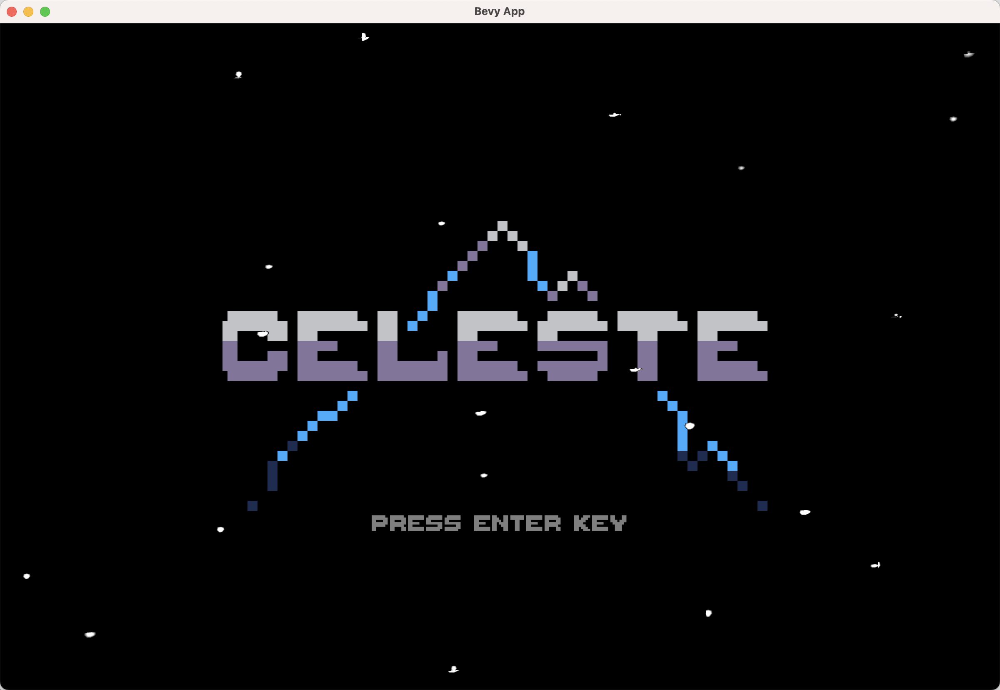
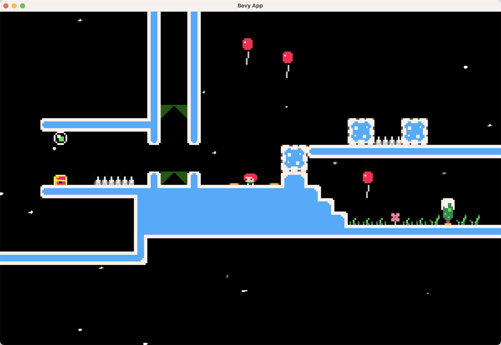

[English](README_EN.md)

# celeste 蔚蓝经典平台跳跃游戏
- [x] Aseprite软件设计像素美术
- [x] Ldtk软件编辑关卡
- [x] 加载关卡
- [x] 角色跳跃
- [x] 角色冲刺及动画
- [x] 角色爬墙和蹬墙跳
- [x] 角色死亡重生及动画特效
- [x] 角色头发飘逸效果
- [x] 弹簧、雪堆、陷阱、木架
- [x] 天气效果
- [x] 相机跟随角色
- [x] 游戏ui
- [x] WASM支持

在线游玩：[点这里](https://nightswatchgames.github.io/games/celeste/)（电脑版Chrome/Firefox/Edge打开）

## 运行
1. 本地运行
```
cargo run
```
2. WASM运行
```
rustup target install wasm32-unknown-unknown
cargo install wasm-server-runner
cargo run --target wasm32-unknown-unknown --features bevy_ecs_ldtk/atlas
```
```
cargo install wasm-bindgen-cli
cargo build --release --target wasm32-unknown-unknown --features bevy_ecs_ldtk/atlas
wasm-bindgen --out-dir ./out/ --target web ./target/wasm32-unknown-unknown/release/celeste.wasm
```

## 控制
- `A` `D` 移动
- `K` 跳跃
- `J` 冲刺

## 游戏展示
视频演示：[B站](https://www.bilibili.com/video/BV14v4y1n7qk)



## 参考
- [Celeste Official source project](https://github.com/NoelFB/Celeste)
- [U3D教程实现《蔚蓝 Celeste 》Movement 系统](https://www.bilibili.com/video/BV1D4411d7Xn)
- [casuak/Game_1_Tiny_Celeste_v3](https://github.com/casuak/Game_1_Tiny_Celeste_v3)
- [LDtk一小时完全入门教程](https://www.bilibili.com/video/BV1y64y1z7Uw)

## 问题
**1.像素完美 (Pixel Perfect) 是什么意思？**

指确保像素图像在不同分辨率下始终保持锐利清晰，并在运动中保持稳定，在Bevy中通过`ImagePlugin::default_nearest()`设置。

参考
- https://docs.unity3d.com/cn/2019.4/Manual/com.unity.2d.pixel-perfect.html
- https://github.com/bevyengine/bevy/blob/main/examples/2d/pixel_perfect.rs


**2.常见角色控制有哪些方式？**

1. 通过`Transform`组件直接指定角色坐标
2. 通过设置`RigidBody`刚体组件，利用物理引擎（力、速度、加速度等）控制角色
3. 通过`CharacterController`来控制角色，它不受物理（如重力）限制，会自动处理碰撞检测，移动，跳跃等，可以很方便地实现在各种复杂地形中运动
4. 通过为角色添加NavMesh Agent组件并使用导航网格系统来实现角色的自动寻路和移动
5. 通过为角色添加Animator组件并使用动画系统来实现角色的移动、旋转和动作
6. 通过编写自定义脚本来实现角色的移动、旋转和碰撞

参考
- https://rapier.rs/docs/user_guides/bevy_plugin/character_controller/
- https://docs.unity3d.com/cn/2021.1/Manual/class-CharacterController.html